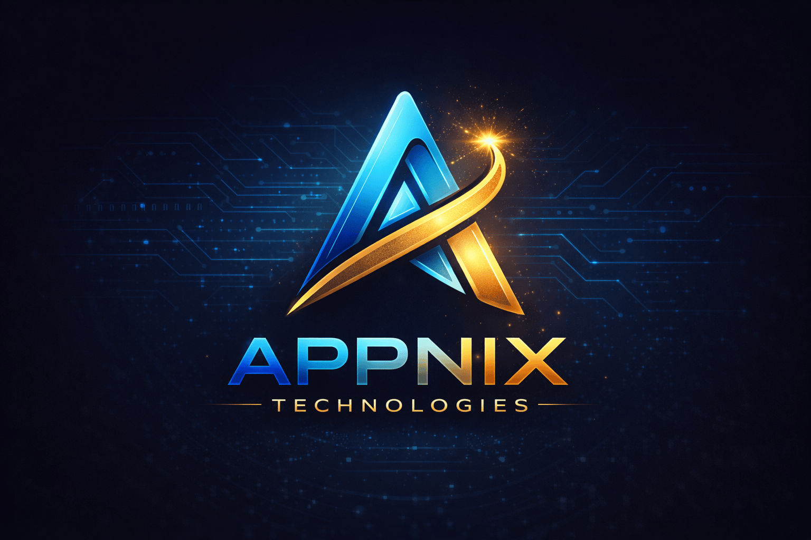

# Appnix Technologies - Complete Tech Solutions Provider

<div align="center">
  
  
  **Transforming Ideas into Exceptional Digital Experiences**
  
  [](https://appnix.org)
  [](https://www.linkedin.com/company/appnix-technologies)
  [](https://x.com/AppnixTech)
</div>

---

## 🌟 About Appnix Technologies

Appnix Technologies is a **global technology company** specializing in building innovative digital solutions that empower businesses to thrive in the digital age. From startups to enterprises, we deliver cutting-edge technology solutions that drive measurable results and sustainable growth.

### 🎯 Our Mission
To empower businesses with cutting-edge technology solutions that drive measurable results and sustainable growth through innovation, quality, and reliability.

### 👁️ Our Vision
To become the most trusted technology partner for businesses worldwide, known for innovation, quality, and reliability in every project we deliver.

### 🚀 Our Approach
We combine strategic thinking with technical excellence, delivering solutions that are:
- **Scalable** - Built to grow with your business
- **Maintainable** - Clean code and documentation
- **Future-proof** - Modern technologies and best practices
- **Customer-oriented** - Your success is our priority

---

## 💼 Our Services

### 🌐 Web Development
Custom web applications built with modern frameworks like React, Next.js, and Vue.js. We create high-performance, responsive websites optimized for user experience and conversion.

**Key Features:**
- Progressive Web Apps (PWA)
- Single Page Applications (SPA)
- E-commerce platforms
- Custom CMS solutions
- API integrations

### 📱 App Development
Native and cross-platform mobile applications that deliver seamless experiences on iOS and Android using React Native, Flutter, and native technologies.

**Capabilities:**
- iOS & Android native apps
- Cross-platform solutions
- Real-time features
- Offline functionality
- Push notifications

### ⚡ MERN Stack Development
Full-stack solutions using MongoDB, Express.js, React, and Node.js for scalable, modern web applications with real-time capabilities.

**Expertise:**
- RESTful API development
- Real-time applications
- Database architecture
- Authentication & authorization
- Cloud deployment

### 📝 WordPress Development
Custom WordPress themes, plugins, and e-commerce solutions tailored to your business needs with WooCommerce integration.

**Services:**
- Custom theme development
- Plugin development
- WooCommerce stores
- Performance optimization
- Security hardening

### 🔧 Website Maintenance
Ongoing support, security updates, performance optimization, and technical maintenance services to keep your digital assets running smoothly.

**Includes:**
- 24/7 monitoring
- Security patches
- Performance optimization
- Content updates
- Backup management

### 📢 Digital Marketing
Data-driven SEO, PPC, content marketing, and growth strategies to maximize your online presence and drive qualified traffic.

**Strategies:**
- Search Engine Optimization (SEO)
- Pay-Per-Click (PPC) campaigns
- Content marketing
- Email marketing
- Conversion optimization

### 📱 Social Media Management
Strategic social media campaigns, content creation, and community management across all platforms to build your brand presence.

**Platforms:**
- Facebook & Instagram
- Twitter/X & LinkedIn
- YouTube & TikTok
- Content calendar planning
- Analytics & reporting

### 🎨 Graphic Designing
Brand identity, marketing materials, and visual content that captures attention and communicates value effectively.

**Deliverables:**
- Logo & brand identity
- Marketing collateral
- Social media graphics
- Infographics
- Print materials

### 🎯 UI/UX & Figma Design
User-centered interface design, prototyping, and design systems that enhance usability and delight users.

**Process:**
- User research & personas
- Wireframing & prototyping
- Visual design
- Design systems
- Usability testing

---

## 🏆 Why Choose Appnix Technologies?

### 🛡️ Enterprise Security
Bank-grade security practices and compliance standards for every project. We implement industry-leading security measures to protect your data and users.

### ⚡ Lightning Fast Delivery
Agile methodology ensures rapid development without compromising quality. We deliver MVPs quickly and iterate based on feedback.

### 👥 Dedicated Teams
Expert developers assigned exclusively to your project for full attention and accountability. Your success is our priority.

### 🕐 24/7 Support
Round-the-clock technical support and maintenance for peace of mind. We're always available when you need us.

### 🏅 Proven Track Record
**200+ projects delivered successfully** with **99% client satisfaction rate**. Our portfolio speaks for itself.

### 💬 Transparent Communication
Regular updates, clear documentation, and open communication channels. You're always in the loop with project progress.

---

## 🛠️ Technology Stack

### Frontend Technologies
- **React 18.3** - Modern UI library
- **TypeScript 5.8** - Type-safe development
- **Tailwind CSS 3.4** - Utility-first styling
- **Framer Motion 12.34** - Smooth animations
- **Vite 5.4** - Lightning-fast build tool

### Backend Technologies
- **Node.js** - Server-side JavaScript
- **Express.js** - Web framework
- **MongoDB** - NoSQL database
- **PostgreSQL** - Relational database
- **Redis** - Caching layer

### Mobile Development
- **React Native** - Cross-platform apps
- **Flutter** - Native performance
- **Swift** - iOS native
- **Kotlin** - Android native

### DevOps & Cloud
- **AWS** - Cloud infrastructure
- **Docker** - Containerization
- **Kubernetes** - Orchestration
- **CI/CD** - Automated deployment
- **Vercel** - Frontend hosting

### Design Tools
- **Figma** - UI/UX design
- **Adobe Creative Suite** - Graphics
- **Sketch** - Interface design
- **InVision** - Prototyping

---

## 🎨 Design System

### Color Palette

#### Light Theme
- **Background**: `hsl(220, 20%, 97%)` - Clean, professional
- **Primary**: `hsl(190, 95%, 42%)` - Vibrant cyan
- **Accent**: `hsl(270, 80%, 60%)` - Modern purple

#### Dark Theme
- **Background**: `hsl(230, 25%, 7%)` - Deep, elegant
- **Primary**: `hsl(190, 95%, 50%)` - Bright cyan
- **Accent**: `hsl(270, 80%, 65%)` - Vivid purple

### Typography
- **Headings**: Space Grotesk - Modern, geometric
- **Body**: Inter - Highly readable

---

## 📊 Our Process

### 1️⃣ Discovery & Planning
We start by understanding your business goals, target audience, and project requirements through detailed consultations.

### 2️⃣ Design & Prototyping
Our designers create wireframes and high-fidelity prototypes that align with your brand and user needs.

### 3️⃣ Development & Testing
Our developers build your solution using best practices, with continuous testing and quality assurance.

### 4️⃣ Launch & Support
We deploy your project and provide ongoing support, maintenance, and optimization services.

---

## 🌟 Key Features of Our Website

### ✨ Modern Design
- Glassmorphic UI elements
- Smooth Framer Motion animations
- Dark/Light theme support
- Responsive mobile-first design

### 🚀 Performance Optimized
- Fast loading times with Vite
- Optimized images and assets
- Lazy loading components
- SEO-friendly structure

### 📱 User Experience
- Intuitive navigation
- Smooth scroll animations
- Interactive elements
- Accessible design (WCAG compliant)

### 🔒 SEO & Security
- Structured data (JSON-LD)
- Meta tags optimization
- Sitemap & robots.txt
- Secure form submissions

### 💬 Communication
- WhatsApp integration
- Contact form with Google Sheets
- Social media links
- Multiple contact methods

---

## 📞 Contact Us

**Location:** Lucknow, Uttar Pradesh, India

**Email:** info@appnix.com

**Phone:** +91 7753983175

**Website:** [appnix.org](https://appnix.org)

### Connect With Us
- [LinkedIn](https://www.linkedin.com/company/appnix-technologies)
- [Twitter/X](https://x.com/AppnixTech)
- [Instagram](https://www.instagram.com/appnixtechnologies)
- [Facebook](https://www.facebook.com/people/Appnix-Technologies/61587716594443)

---

## 🚀 Getting Started

### Installation

```bash
# Clone the repository
git clone https://github.com/appnixtech/appnixtech-website.git

# Navigate to project directory
cd appnixtech-website

# Install dependencies
npm install

# Run development server
npm run dev

# Build for production
npm run build

# Preview production build
npm run preview
```

### Environment Setup

Create a `.env` file in the root directory:

```env
VITE_GOOGLE_SHEETS_URL=your_google_sheets_script_url
VITE_WHATSAPP_NUMBER=919876543210
```

---

## 📄 License

© 2024 Appnix Technologies. All rights reserved.

---

## 🤝 Let's Build Something Amazing Together!

Whether you're a startup looking to launch your MVP or an enterprise seeking to modernize your digital infrastructure, Appnix Technologies is your trusted partner for success.

**Ready to get started?** [Contact us today](https://appnix.org#contact) and let's discuss how we can help transform your ideas into reality.

---

<div align="center">
  <strong>Built with ❤️ by Appnix Technologies</strong>
  
  Transforming Ideas into Exceptional Digital Experiences
</div>
